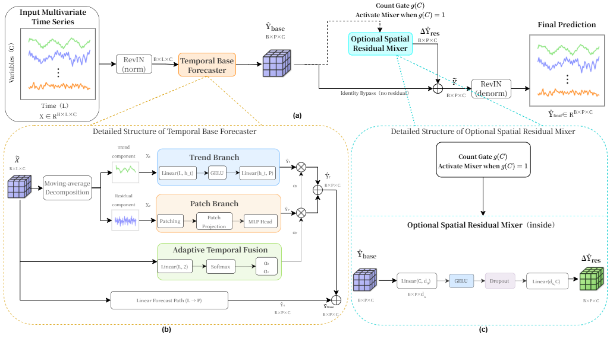

# AdaSRA: Cost-aware Adaptive Spatial Residual Allocation for Long-Term Multivariate Time Series Forecasting

## 📰 News

🚩 Code for AdaSRA is released.

🚩 AdaSRA provides a cost-aware conditional spatial residual allocation framework for long-term multivariate time series forecasting.

## 🌟 Overview

AdaSRA is a cost-aware adaptive spatial residual allocation framework for long-term multivariate time series forecasting.

Existing multivariate forecasting methods often introduce explicit cross-variable modeling through attention, graph structures, channel mixing, or dynamic dependency learning. However, once introduced, such spatial interaction is usually executed as an always-on computation path, although its marginal benefit can vary across datasets and may not always justify the additional cost.

AdaSRA addresses this issue by decomposing forecasting into:

- **Temporal Base Forecaster**: generates a strong temporal base forecast.
- **Optional Spatial Residual Mixer**: provides cross-variable residual correction after temporal base forecasting.
- **Count Gate**: decides whether to activate the spatial residual path using a training-free and near-zero-overhead rule.

The core idea of AdaSRA is simple but effective: spatial residual refinement should be allocated only when it is beneficial, rather than always executed.



## 🛠 Prerequisites

The code is implemented in Python and PyTorch.

We recommend using Python 3.10 and installing the required dependencies by running:

```bash
pip install -r requirements.txt
````

A typical environment is:

```text
Python >= 3.10
PyTorch >= 2.0
CUDA >= 11.8
NumPy
Pandas
scikit-learn
matplotlib
```

## 📊 Prepare Datasets

Please download the required datasets and place them under the `./data` directory.

The expected directory structure is:

```text
data
├── ETTh1.csv
├── ETTh2.csv
├── ETTm1.csv
├── ETTm2.csv
├── weather.csv
├── electricity.csv
├── traffic.csv
├── PEMS03.npz
├── PEMS04.npz
├── PEMS07.npz
└── PEMS08.npz
```

The regular long-term forecasting datasets include:

```text
ETTh1, ETTh2, ETTm1, ETTm2, Weather, Electricity, Traffic
```

The traffic sensor forecasting datasets include:

```text
PEMS03, PEMS04, PEMS07, PEMS08
```

## 💻 Training

All training scripts are located in `./scripts`.

For example, to train AdaSRA on the ETTh1 dataset, run:

```bash
bash ./scripts/etth1.sh
```

You can also run AdaSRA directly with:

```bash
python -u run.py \
  --task_name long_term_forecast \
  --is_training 1 \
  --root_path ./data/ \
  --data_path ETTh1.csv \
  --model_id ETTh1_96_96 \
  --model AdaSRA \
  --data ETTh1 \
  --features M \
  --seq_len 96 \
  --label_len 0 \
  --pred_len 96 \
  --c_out 7 \
  --des Exp \
  --itr 1 \
  --batch_size 32 \
  --learning_rate 0.0001 \
  --channel_mixer_mode adaptive \
  --channel_mixer_threshold 100 \
  --spatial_dim 128
```

## ⚙️ Count Gate

AdaSRA uses a training-free Count Gate to decide whether the Optional Spatial Residual Mixer should be activated:

```text
g(C) = 1, if C > τ
g(C) = 0, if C ≤ τ
```

where:

* `C` is the number of variables.
* `τ` is the activation threshold.
* The default threshold is `τ = 100`.

In the code, this is controlled by:

```bash
--channel_mixer_mode adaptive
--channel_mixer_threshold 100
```

Execution modes:

```text
adaptive   Count Gate-selected execution
on         Always activate the spatial residual mixer
off        Always skip the spatial residual mixer
always_on  Always activate the spatial residual mixer
always_off Always skip the spatial residual mixer
```

## 📁 Project Structure

```text
AdaSRA
├── assets
│   └── pipline.png
├── data_provider
│   ├── __init__.py
│   ├── data_factory.py
│   ├── data_loader.py
│   ├── m4.py
│   └── uea.py
├── exp
│   ├── __init__.py
│   ├── exp_basic.py
│   ├── exp_long_term_forecasting.py
│   └── exp_short_term_forecasting.py
├── layers
│   ├── __init__.py
│   ├── AdaSRA_layers.py
│   ├── Embed.py
│   └── StandardNorm.py
├── models
│   ├── __init__.py
│   └── AdaSRA.py
├── scripts
│   └── etth1.sh
├── utils
│   ├── __init__.py
│   ├── ADTest.py
│   ├── augmentation.py
│   ├── dtw_metric.py
│   ├── dtw.py
│   ├── losses.py
│   ├── m4_summary.py
│   ├── masking.py
│   ├── metrics.py
│   ├── print_args.py
│   ├── timefeatures.py
│   └── tools.py
├── README.md
├── requirements.txt
└── run.py
```

## 📌 Output Files

After training and testing:

* Model checkpoints are saved in:

```text
./checkpoints
```

* Forecasting results are saved in:

```text
./results
```

* Test summaries are saved in:

```text
./result_long_term_forecast.txt
```

## 📚 Citation

If you find this repository useful, please consider citing our paper:

```bibtex
@article{wu2026adasra,
  title={AdaSRA: Cost-aware Adaptive Spatial Residual Allocation for Long-Term Multivariate Time Series Forecasting},
  author={Wu, Yue and Zhai, Junhai},
  journal={},
  year={2026}
}
```

The BibTeX entry will be updated after publication.

## 🙏 Acknowledgement

This repository is built upon several excellent time series forecasting codebases and benchmarks.

We thank the authors of the following repositories for their valuable contributions:

* [Time-Series-Library](https://github.com/thuml/Time-Series-Library)
* [PatchTST](https://github.com/yuqinie98/PatchTST)
* [iTransformer](https://github.com/thuml/iTransformer)
* [DUET](https://github.com/decisionintelligence/DUET)


